# 智慧养老院管理系统 

##（源代码+12000字文档+ppt）

## 项目简介
智慧养老院管理系统是一套基于SpringBoot的前后端分离的多角色的养老院系统，分为超级管理员、销售管理员、人事管理员、服务管理员、餐饮管理员、财务管理员，多个角色。 
系统管理人员拥有全部功能，并且可以对系统进行整体业务监控。 
销售管理员可以对用户的咨询信息进行管理，并且可以对用户的房间预定进行管理。 
财务管理员可以对用户的预存充值进行管理，可以查询用户的消费记录，以及对用户的退住申请进行审核。 
服务管理员和餐饮管理员可以对养老院的服务项目、护理登记、菜品管理、餐饮套餐、额外点餐、服务预定等进行管理。 
人事管理员可以对员工信息以及养老院的长者档案进行管理。 
前端使用Vue框架，后端使用SpringBoot框架，数据库使用的是Mysql。 
本系统功能完善，涉及的技术比较广，难度适中，都是市面上主流的技术，非常适合作为设计项目或开发学习。 
视频介绍：<a href="https://www.bilibili.com/video/BV1UFUvY6EZ4/?spm_id_from=333.999.0.0" target="_blank">点击查看B站视频介绍</a>

## 功能介绍

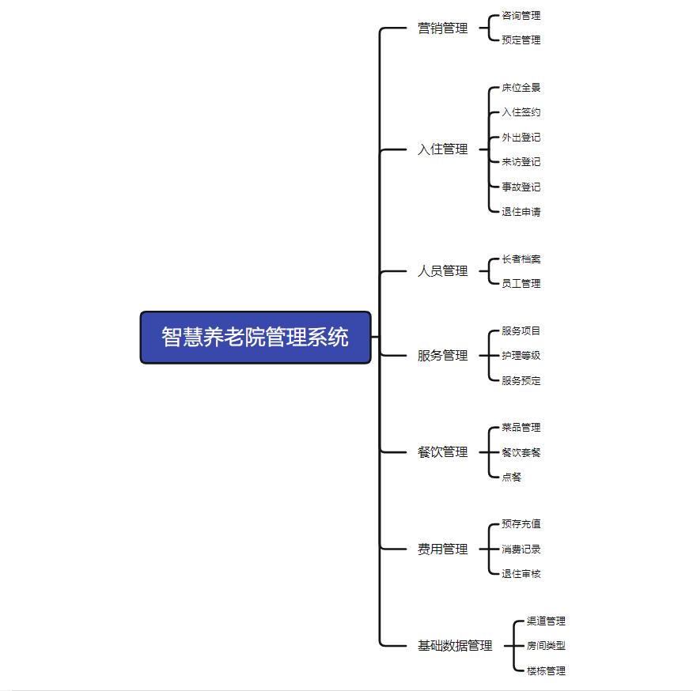

## 技术学习

如果你有任何需求，可以关注本人公众号获取本人联系方式进行咨询。 
公众号内还有更多项目供你选择。 

## 技术服务

## 技术栈

| 工具及技术             | 版本    |
| ---------------------- | ------- |
| idea                   |         |
| JDK                    | 1.8     |
| SpringBoot             | 2.2.1   |
| MyBatis                | 1.3.2   |
| JWT                    | 3.4     |
| Vue                    | 2.0     |
| ElementUI              | 2.0     |
| MySQL                  | 5.7     |
| Node                   | v16.16.0|

## 系统图片

#### 1.登录页
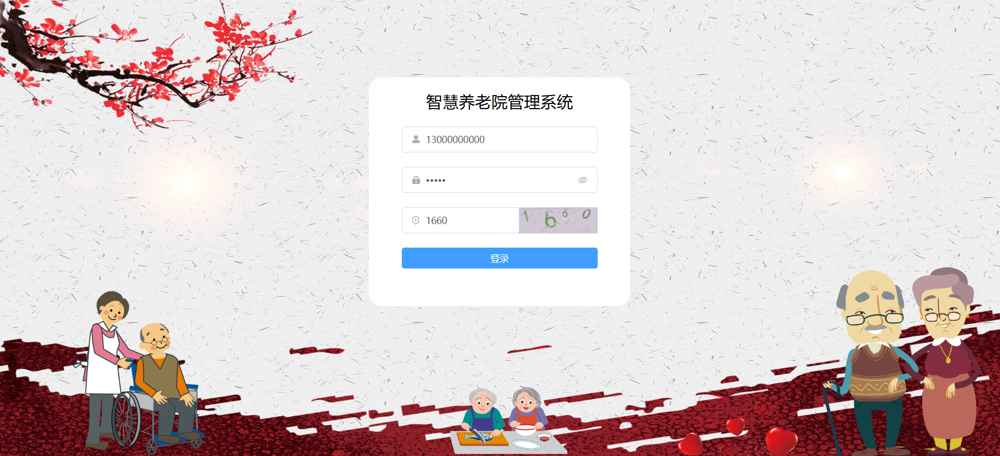 
#### 2.管理员首页
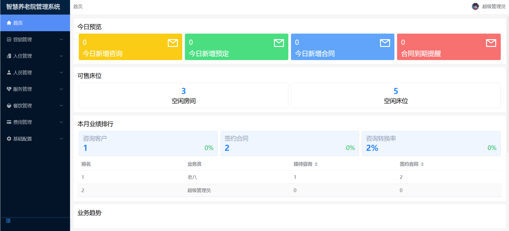 
#### 3.咨询管理
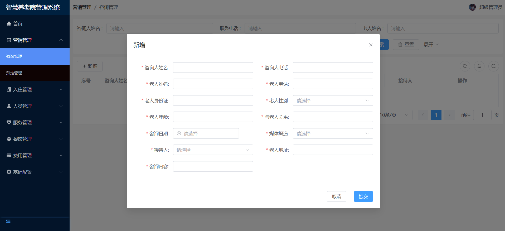 
#### 4.入住签约
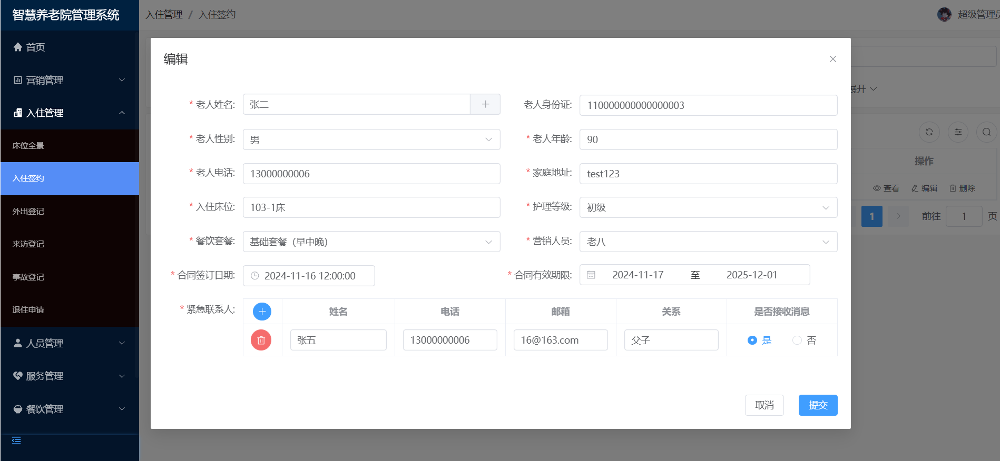 
#### 5.床位全景
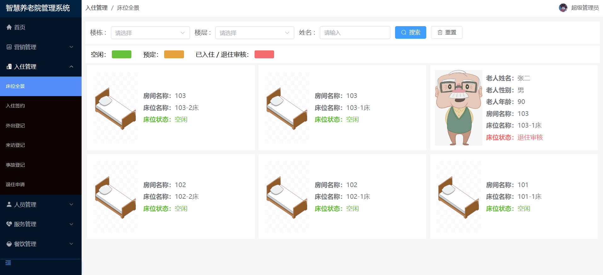 
#### 6.外出登记
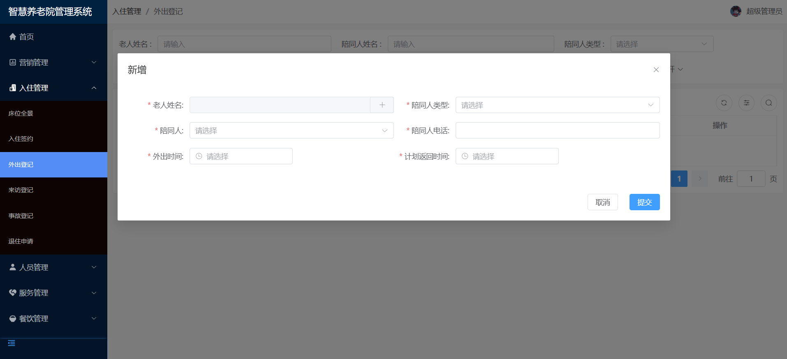 
#### 7.来访登记
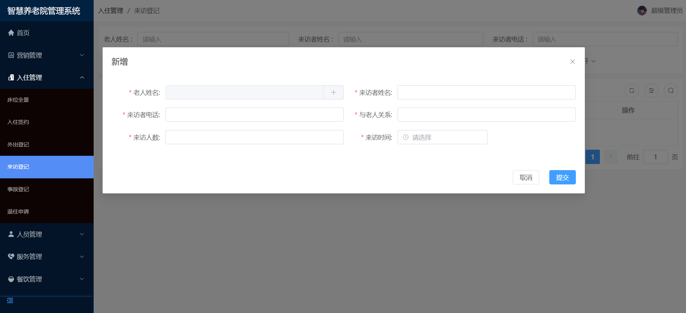 
#### 8.事故登记
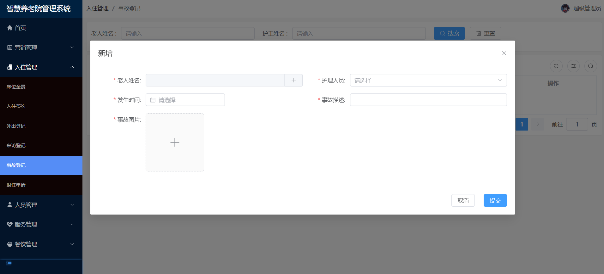 
#### 9.员工管理
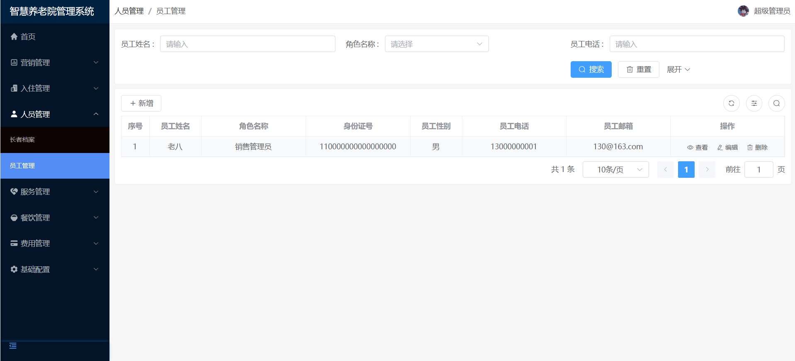 
#### 10.服务项目管理
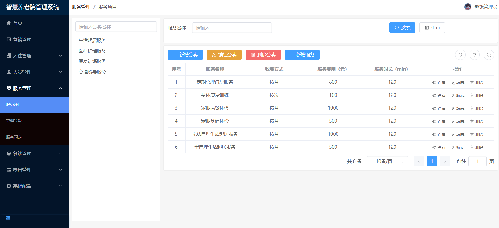 
#### 11.菜品管理
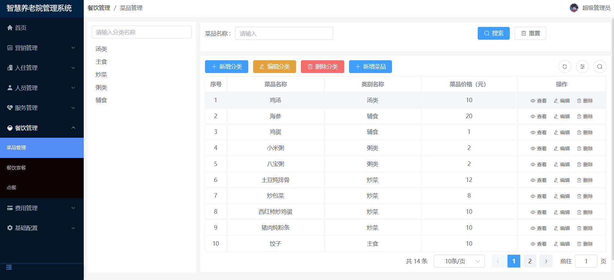 
#### 12.楼栋管理
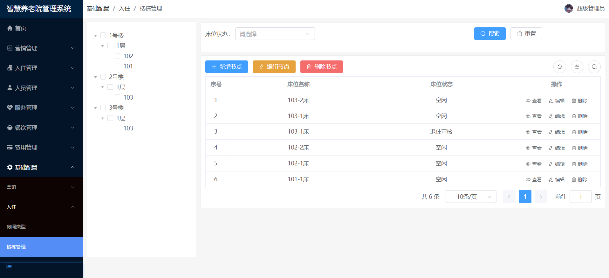 

